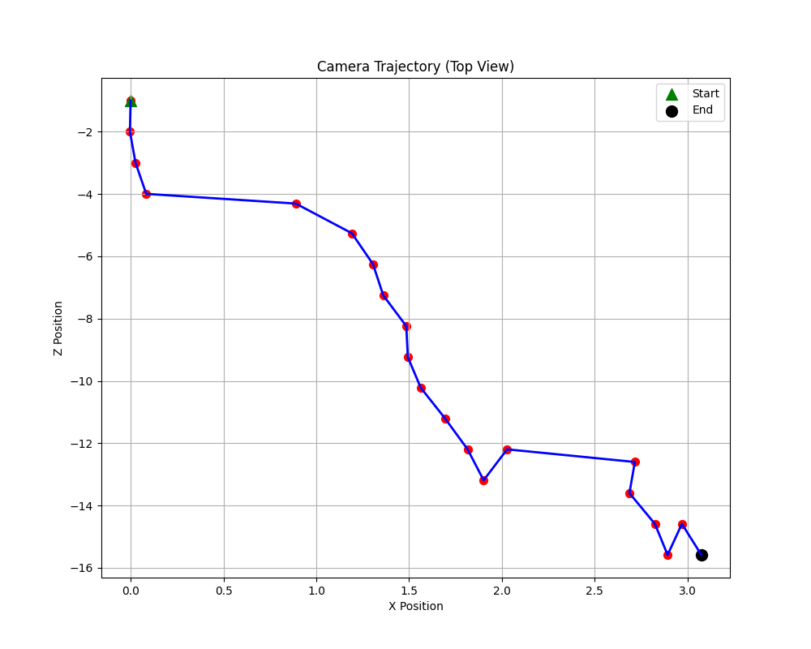

# Visual Odometry

A Python implementation of a visual odometry system that tracks camera motion through a sequence of images.

## Overview

This repository contains a monocular visual odometry implementation that:

1. Processes raw camera images (undistortion, color conversion)
2. Extracts and matches features between consecutive frames using SIFT
3. Estimates the fundamental matrix using RANSAC
4. Recovers the essential matrix and camera pose
5. Triangulates 3D points and tracks camera motion

## Example Results



The system successfully tracks camera motion from a sequence of images. The blue line shows the camera path, with a green triangle marking the start position and a black circle marking the end position.

## Project Structure

```
visual-odometry/
├── camera_model.py        # Camera model and image processing
├── feature_matcher.py     # SIFT feature detection and matching
├── ransac_fundamental_matrix.py # Fundamental matrix estimation
├── motion_tracker.py      # Main motion tracking system
├── main.py                # Entry point for running the system
├── requirements.txt       # Python dependencies
├── model/                 # Camera model files
│   ├── stereo_narrow_left.txt
│   └── stereo_narrow_left_distortion_lut.bin
├── images/                # Input image sequence
└── results/               # Output results
    ├── matches/           # Feature matches visualizations
    ├── camera_trajectory.png
    └── trajectory.npy
```

## Requirements

- Python 3.x
- NumPy
- OpenCV
- Matplotlib
- SciPy

## Data

The system requires two types of data:

### 1. Camera Model Files

These files contain camera calibration information and the lookup table for undistortion:

- `stereo_narrow_left.txt` - Contains camera intrinsic parameters
- `stereo_narrow_left_distortion_lut.bin` - Contains the undistortion lookup table

You can download these files from:
- [Oxford Robotcar Dataset](https://robotcar-dataset.robots.ox.ac.uk/downloads/) (requires registration)
- Or create a sample version using:
  ```python
  # Example content for stereo_narrow_left.txt
  # fx fy cx cy
  964.828979 964.828979 643.788025 484.407990
  # Camera to image transform (4x4 matrix)
  0.000000 -0.000000 1.000000 0.000000
  1.000000 0.000000 -0.000000 0.000000
  0.000000 1.000000 0.000000 0.000000
  0.000000 0.000000 0.000000 1.000000
  ```

### 2. Image Sequence

The system requires a sequence of images captured from a moving camera. You can use:

- [KITTI Visual Odometry Dataset](http://www.cvlibs.net/datasets/kitti/eval_odometry.php)
- [Oxford Robotcar Dataset](https://robotcar-dataset.robots.ox.ac.uk/)
- [TUM RGB-D Dataset](https://vision.in.tum.de/data/datasets/rgbd-dataset)

Download instructions for KITTI (example):
```bash
# Download a sequence
wget https://s3.eu-central-1.amazonaws.com/avg-kitti/raw_data/2011_09_26_drive_0001/2011_09_26_drive_0001_sync.zip

# Extract images
unzip 2011_09_26_drive_0001_sync.zip -d data
# Copy image files to your images/ directory
cp data/2011_09_26/2011_09_26_drive_0001_sync/image_00/data/*.png images/
```

Place the camera model files in the `model/` directory and the image sequence in the `images/` directory.

## Setup

### Using conda (recommended)

```bash
# Create a new conda environment
conda create -n vo python=3.10
conda activate vo

# Install dependencies
conda install -c conda-forge numpy opencv matplotlib scipy

# Clone the repository
git clone https://github.com/yourusername/visual-odometry.git
cd visual-odometry
```

### Using pip

```bash
# Create a virtual environment
python -m venv venv
source venv/bin/activate  # On Windows: venv\Scripts\activate

# Install dependencies
pip install -r requirements.txt
```

## Usage

### Running the Visual Odometry System

```bash
# Basic usage (uses default paths)
python main.py

# Specify custom paths
python main.py --models /path/to/model --images /path/to/images --output /path/to/results
```

### Command Line Arguments

- `--models`: Path to directory containing camera model files (default: `./model`)
- `--images`: Path to directory containing image sequence (default: `./images`)
- `--output`: Path to output directory for results (default: `./results`)
- `--max_frames`: Maximum number of frames to process (default: all frames)

## Implementation Details

### Camera Model

The `CameraModel` class handles:
- Loading camera intrinsic parameters
- Undistorting images using lookup tables
- Converting Bayer pattern images to RGB

### Feature Matching

The `FeatureMatcher` class implements:
- SIFT feature detection
- Feature matching with ratio test
- Visualization of matches between frames

### Fundamental Matrix Estimation

The `RANSACFundamentalMatrix` class provides:
- Normalized 8-point algorithm
- RANSAC for robust estimation
- Inlier selection based on epipolar constraints

### Motion Tracking

The `MotionTracker` class:
- Computes essential matrix from fundamental matrix
- Decomposes essential matrix to recover camera pose
- Triangulates 3D points to verify pose configurations
- Builds and visualizes camera trajectory

## License

MIT License

## Acknowledgments

This implementation is based on multiple-view geometry principles and algorithms as described in the book "Multiple View Geometry in Computer Vision" by Richard Hartley and Andrew Zisserman.